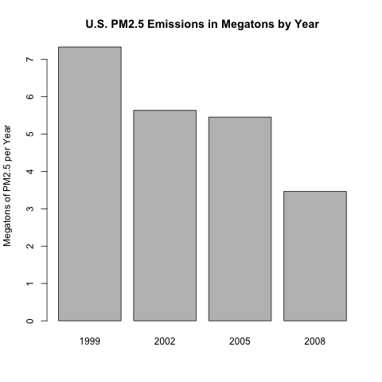
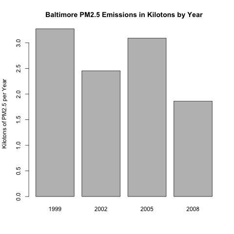
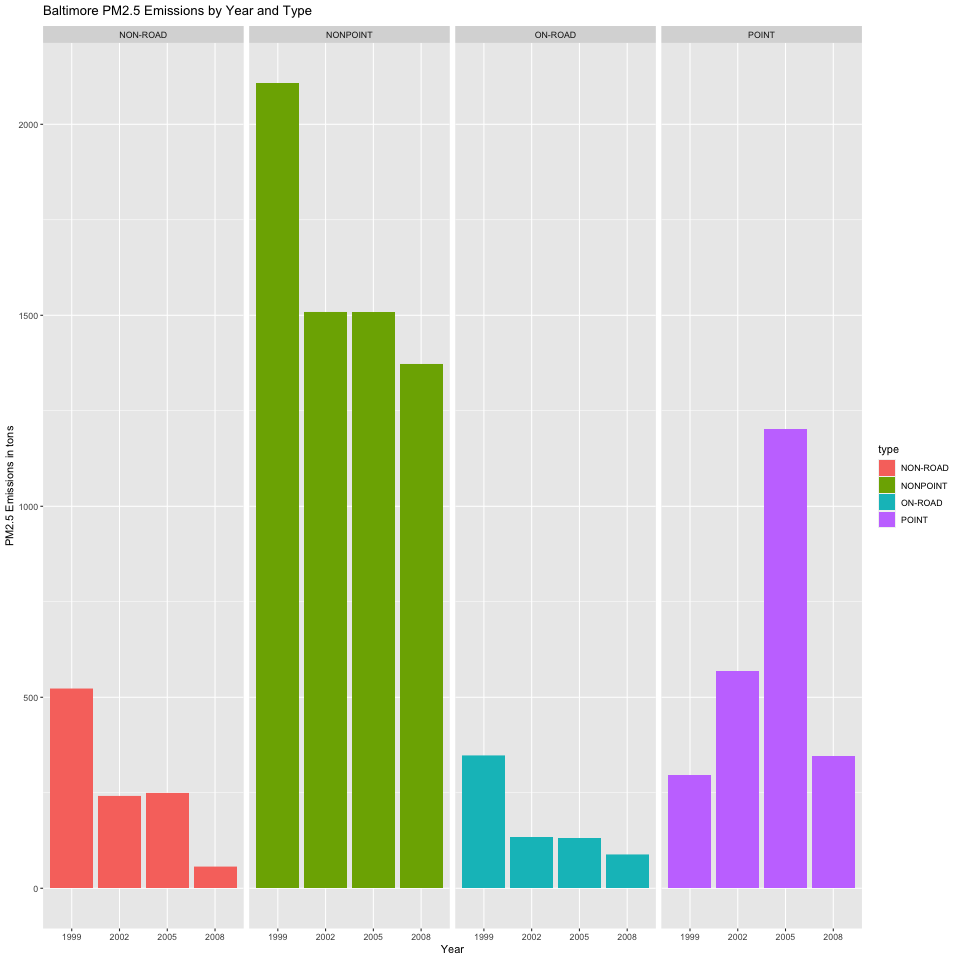
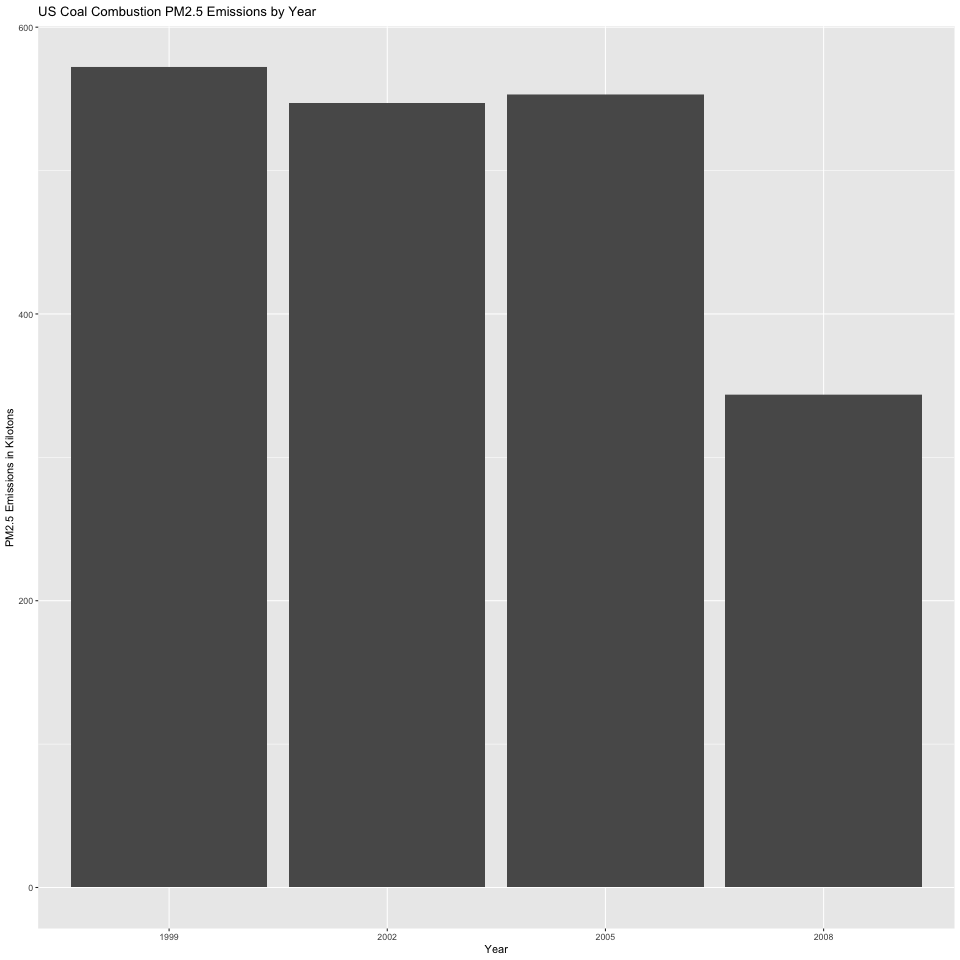
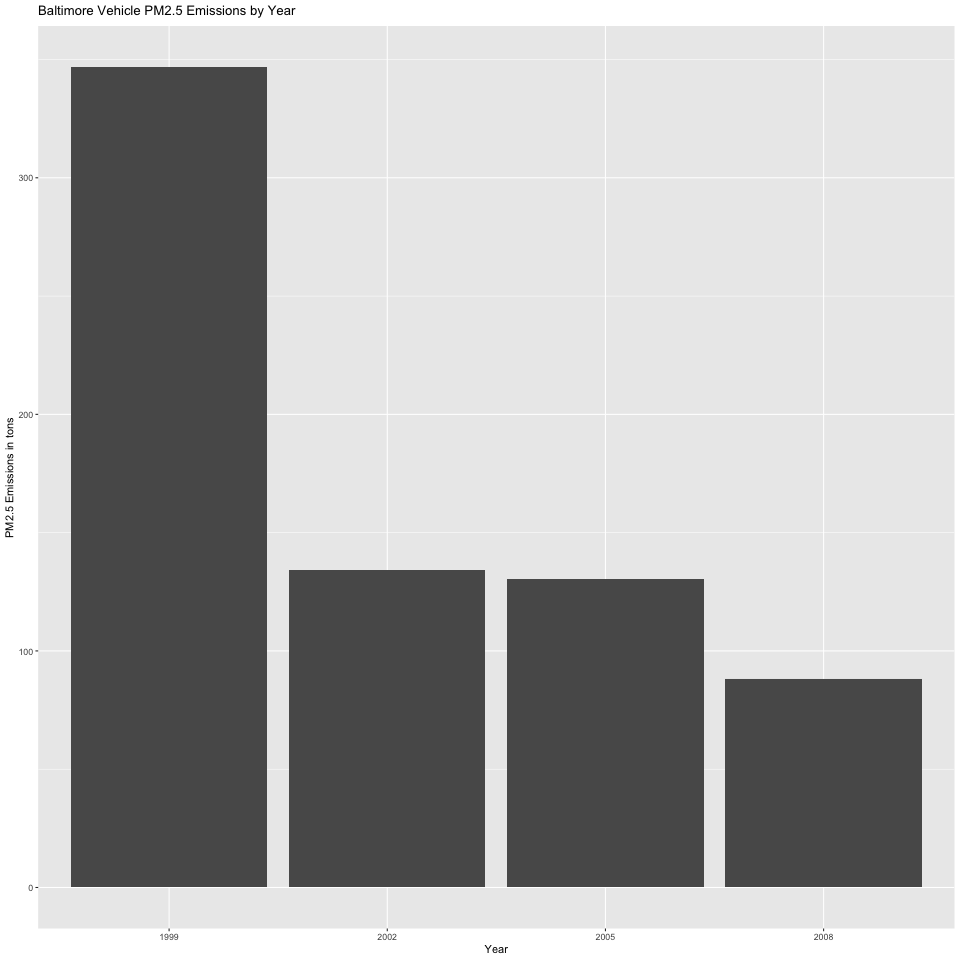
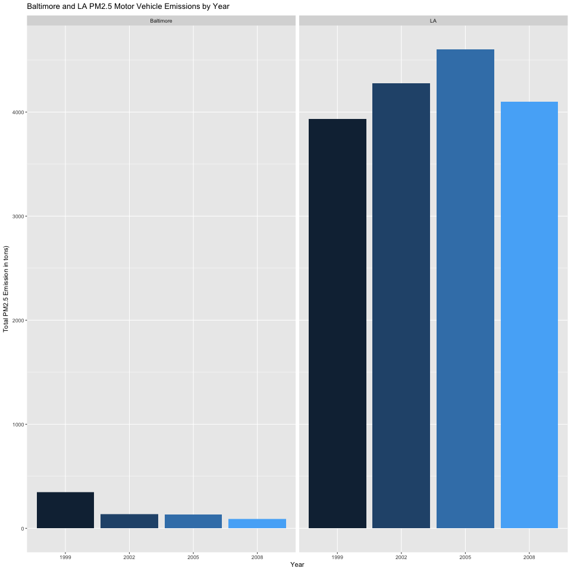

## 4. Exploratory Data Analysis Project 2

by C. Bleile

See README.md for Assignment Details

###Assignment
The overall goal of this assignment is to explore the National Emissions Inventory database and see what it say about fine particulate matter pollution in the United states over the 10-year period 1999–2008. You may use any R package you want to support your analysis.

**Questions**

You must address the following questions and tasks in your exploratory analysis. For each question/task you will need to make a single plot. Unless specified, you can use any plotting system in R to make your plot.

1..Have total emissions from PM2.5 decreased in the United States from 1999 to 2008? Using the base plotting system, make a plot showing the total PM2.5 emission from all sources for each of the years 1999, 2002, 2005, and 2008.

	## Script to explore R Base Graphing Package as part of Cousera JHU Data Science Course
	## This is Project 2 of Course 4 - Exploratory Data Analysis, this produces plot 1 of 6 a histogram of PM2.5 particle emissions in the US from 1999-2008
	## by C. Bleile
		
	# Outline:
	# 1. Set environment
	# 2. Import R Data Set to NEI from "summarySCC_PM25.rds" and SCC from "Source_Classification_Code.rds" both from "exdata_data_NEI_data.zip"
	# 3. Output the plot
	
	# 1. Set environment, you can make the working directory anything that works for you, just make sure the .rds files are there.
	setwd("~") #Set the working directory to the user's home directory; NOTE: unzipped, downloaded data should be here.
	
	# 2. Import data.table from "household_power_consumption.txt"
	NEI <- readRDS("~/summarySCC_PM25.rds")
	SCC <- readRDS("~/Source_Classification_Code.rds")
	
	# 3. Output the plot
	png("plot1.png", width=480, height=480) #sets output device to plot1.png located in the working directory
	barplot(tapply(NEI$Emissions/1000000, format(NEI$year), FUN=sum))
	title(main="U.S. PM2.5 Emissions in Megatons by Year", ylab="Megatons of PM2.5 per Year")
	dev.off() #closes the png output device

2..Have total emissions from PM2.5 decreased in the Baltimore City, Maryland (fips == "24510") from 1999 to 2008? Use the base plotting system to make a plot answering this question.

	## Script to explore R Base Graphing Package as part of Cousera JHU Data Science Course
	## This is Project 2 of Course 4 - Exploratory Data Analysis, this produces plot 2 of 6 a histogram of PM2.5 particle emissions in the US from 1999-2008
	## by C. Bleile
	
	# Outline:
	# 1. Set environment
	# 2. Import R Data Set to NEI from "summarySCC_PM25.rds" and SCC from "Source_Classification_Code.rds" both from "exdata_data_NEI_data.zip"
	# 3. Subset the data
	# 4. Output the plot
	
	# 1. Set environment, you can make the working directory anything that works for you, just make sure the .rds files are there.
	setwd("~") #Set the working directory to the user's home directory; NOTE: unzipped, downloaded data should be here.
	
	# 2. Import data.table from "household_power_consumption.txt"
	NEI <- readRDS("~/summarySCC_PM25.rds")
	SCC <- readRDS("~/Source_Classification_Code.rds")
	
	# 3. Subset the data for just Baltimore
	BaltNEI <- subset(NEI, fips == "24510")
	
	# 4. Output the plot
	png("plot2.png", width=480, height=480) #sets output device to plot2.png located in the working directory
	barplot(tapply(BaltNEI$Emissions/1000, format(BaltNEI$year), FUN=sum))
	title(main="Baltimore PM2.5 Emissions in Kilotons by Year", ylab="Kilotons of PM2.5 per Year")
	dev.off() #closes the png output device

3..Of the four types of sources indicated by the \color{red}{\verb|type|}type (point, nonpoint, onroad, nonroad) variable, which of these four sources have seen decreases in emissions from 1999–2008 for Baltimore City? Which have seen increases in emissions from 1999–2008? Use the ggplot2 plotting system to make a plot answer this question.

	## Script to explore R Base Graphing Package as part of Cousera JHU Data Science Course
	## This is Project 2 of Course 4 - Exploratory Data Analysis, this produces plot 3 of 6 a histogram of PM2.5 particle emissions in the Baltimore by type from 1999-2008
	## by C. Bleile
	
	# Outline:
	# 1. Set environment
	# 2. Import R Data Set to NEI from "summarySCC_PM25.rds" and SCC from "Source_Classification_Code.rds" both from "exdata_data_NEI_data.zip"
	# 3. Subset the data
	# 4. Output the plot
	
	# 1. Set environment, you can make the working directory anything that works for you, just make sure the .rds files are there.
	setwd("~") #Set the working directory to the user's home directory; NOTE: unzipped, downloaded data should be here.
	library(ggplot2)
	
	# 2. Import data.table from "household_power_consumption.txt"
	NEI <- readRDS("~/summarySCC_PM25.rds")
	SCC <- readRDS("~/Source_Classification_Code.rds")
	
	# 3. Subset the data for just Baltimore
	BaltNEI <- subset(NEI, fips == "24510")
	
	# 4. Output the plot
	png("plot3.png", width=960, height=960) #sets output device to plot3.png located in the working directory
	
	ggplot(BaltNEI, aes(factor(year), Emissions, fill=type)) +
	    geom_bar(stat="identity") +
	    facet_grid(.~type, scales = "free", space="free") +
	    labs(title=expression("Baltimore PM2.5 Emissions by Year and Type")) +
	    labs(x="Year", y=expression("PM2.5 Emissions in tons"))
	
	dev.off() #closes the png output device

4..Across the United States, how have emissions from coal combustion-related sources changed from 1999–2008?

	## Script to explore R Base Graphing Package as part of Cousera JHU Data Science Course
	## This is Project 2 of Course 4 - Exploratory Data Analysis, this produces plot 4 of 6 a histogram of PM2.5 particle emissions in the Baltimore by type from 1999-2008
	## by C. Bleile
	
	# Outline:
	# 1. Set environment
	# 2. Import R Data Set to NEI from "summarySCC_PM25.rds" and SCC from "Source_Classification_Code.rds" both from "exdata_data_NEI_data.zip"
	# 3. Subset the data
	# 4. Output the plot
	
	# 1. Set environment, you can make the working directory anything that works for you, just make sure the .rds files are there.
	setwd("~") #Set the working directory to the user's home directory; NOTE: unzipped, downloaded data should be here.
	library(ggplot2)
	
	# 2. Import data.table from "household_power_consumption.txt"
	NEI <- readRDS("~/summarySCC_PM25.rds")
	SCC <- readRDS("~/Source_Classification_Code.rds")
	
	# 3. Subset the data for just Baltimore
	coalSCCidx <- grep("coal", SCC$EI.Sector, ignore.case=TRUE) #Create subset index for SCC where EI.Sector = Coal Combustion, does not count Lignite
	coalSCC <- SCC$SCC[coalSCCidx] #Create a vector of valid SCC codes to match to for the NEI database.
	coalNEI <- subset(NEI, NEI$SCC %in% coalSCC)  #subset the table for coal combustion (where the NEI$SCC matches a value in the list of valid SCC codes)
	
	# 4. Output the plot
	png("plot4.png", width=960, height=960) #sets output device to plot4.png located in the working directory
	
	ggplot(coalNEI, aes(factor(year), Emissions/1000)) +
	    geom_bar(stat="identity") +
	    labs(title=expression("US Coal Combustion PM2.5 Emissions by Year")) +
	    labs(x="Year", y=expression("PM2.5 Emissions in Kilotons"))
	
	dev.off() #closes the png output device

5.. How have emissions from motor vehicle sources changed from 1999–2008 in Baltimore City?

	## Script to explore R Base Graphing Package as part of Cousera JHU Data Science Course
	## This is Project 2 of Course 4 - Exploratory Data Analysis, this produces plot 5 of 6 a histogram of PM2.5 particle emissions in the Baltimore from vehicles
	# by C. Bleile
	
	# Outline:
	# 1. Set environment
	# 2. Import R Data Set to NEI from "summarySCC_PM25.rds" and SCC from "Source_Classification_Code.rds" both from "exdata_data_NEI_data.zip"
	# 3. Subset the data
	# 4. Output the plot
	
	# 1. Set environment, you can make the working directory anything that works for you, just make sure the .rds files are there.
	setwd("~") #Set the working directory to the user's home directory; NOTE: unzipped, downloaded data should be here.
	library(ggplot2)
	
	# 2. Import data.table from "household_power_consumption.txt"
	NEI <- readRDS("~/summarySCC_PM25.rds")
	SCC <- readRDS("~/Source_Classification_Code.rds")
	
	# 3. Subset the data for just Baltimore
	BaltNEI <- subset(NEI, fips == "24510")
	vehSCC <- subset(SCC, Data.Category == "Onroad")
	vehSCClist <- vehSCC$SCC #Create a vector of valid SCC codes to match to for the NEI database.
	BaltVehNEI <- subset(BaltNEI, BaltNEI$SCC %in% vehSCClist)  #subset the table for Baltimore Vehicle Emissions
	
	# 4. Output the plot
	png("plot5.png", width=960, height=960) #sets output device to plot5.png located in the working directory
	
	ggplot(BaltVehNEI, aes(factor(year), Emissions)) +
	    geom_bar(stat="identity") +
	    labs(title=expression("Baltimore Vehicle PM2.5 Emissions by Year")) +
	    labs(x="Year", y=expression("PM2.5 Emissions in tons"))
	
	dev.off() #closes the png output device

6.. Compare emissions from motor vehicle sources in Baltimore City with emissions from motor vehicle sources in Los Angeles County, California (fips == "06037"). Which city has seen greater changes over time in motor vehicle emissions?

	## Script to explore R Base Graphing Package as part of Cousera JHU Data Science Course
	## This is Project 2 of Course 4 - Exploratory Data Analysis, this produces plot 6 of 6 a histogram of PM2.5 particle emissions comparing Batlimore and LA vehicle emissions
	# by C. Bleile
	
	# Outline:
	# 1. Set environment
	# 2. Import R Data Set to NEI from "summarySCC_PM25.rds" and SCC from "Source_Classification_Code.rds" both from "exdata_data_NEI_data.zip"
	# 3. Subset the data
	# 4. Output the plot
	
	# 1. Set environment, you can make the working directory anything that works for you, just make sure the .rds files are there.
	setwd("~") #Set the working directory to the user's home directory; NOTE: unzipped, downloaded data should be here.
	library(ggplot2)
	
	# 2. Import data.table from "household_power_consumption.txt"
	NEI <- readRDS("~/summarySCC_PM25.rds")
	SCC <- readRDS("~/Source_Classification_Code.rds")
	
	# 3. Subset the data
	# a. subset for vehicle emissions
	vehSCC <- subset(SCC, Data.Category == "Onroad")
	vehSCClist <- vehSCC$SCC #Create a vector of valid SCC codes to match to for the NEI database.
	
	# b. subset for Baltimore
	BaltNEI <- subset(NEI, fips == "24510")
	BaltNEI$Place <- "Baltimore"
	BaltVehNEI <- subset(BaltNEI, BaltNEI$SCC %in% vehSCClist)  #subset the table for Baltimore Vehicle Emissions
	
	# c. subset for LA
	LANEI <- subset(NEI, fips == "06037")
	LANEI$Place <- "LA"
	LAVehNEI <- subset(LANEI, LANEI$SCC %in% vehSCClist)  #subset the table for LA Vehicle Emissions
	
	# d. bind the two cities into a single dataset
	BaLAVehNEI <- rbind(BaltVehNEI, LAVehNEI)
	
	# 4. Output the plot
	png("plot6.png", width=960, height=960) #sets output device to plot6.png located in the working directory
	
	ggplot(BaLAVehNEI, aes(x=factor(year), y=Emissions, fill=Place)) +
	    geom_bar(aes(fill=year), stat="identity") +
	    facet_grid(scales="free", space="free", .~Place) +
	    guides(fill=FALSE) +
	    labs(title=expression("Baltimore and LA PM2.5 Motor Vehicle Emissions by Year")) +
	    labs(x="Year", y=expression("Total PM2.5 Emission in tons)"))
	
	dev.off() #closes the png output device

###Usage
There are six .R scripts (plot1.R, ... plot6.R) that assume the data from the link above (exdata_data_NEI_data.zip) has been downloaded and unzipped into the user's home directory.  The scripts are assumed to be colocated.  The scripts are run and individually and each results in a plot (plot1.png, ... plot6.png) written to the working directory.  

If the user desires, one can modify the working directory for each script to perform in a directory of their choice by replacing the "~" in each script with a working directory of their choice.  It would be trivial to make a function that accepted a WD as well.